## Writeup Template

### You can use this file as a template for your writeup if you want to submit it as a markdown file, but feel free to use some other method and submit a pdf if you prefer.

---

**Advanced Lane Finding Project**

The goals / steps of this project are the following:

* Compute the camera calibration matrix and distortion coefficients given a set of chessboard images.
* Apply a distortion correction to raw images.
* Use color transforms, gradients, etc., to create a thresholded binary image.
* Apply a perspective transform to rectify binary image ("birds-eye view").
* Detect lane pixels and fit to find the lane boundary.
* Determine the curvature of the lane and vehicle position with respect to center.
* Warp the detected lane boundaries back onto the original image.
* Output visual display of the lane boundaries and numerical estimation of lane curvature and vehicle position.

[//]: # (Image References)

[image1]: ./examples/undistort_output.png "Undistorted"
[image3]: ./examples/filter_result.jpg "Grad and HLS result"
[image2]: ./test_images/test1.jpg "Road Transformed"
[image4]: ./examples/warped_straight_lines.jpg "Warp Example"
[image5]: ./examples/color_fit_lines.jpg "Fit Visual"
[image6]: ./examples/example_output.jpg "Output"
[image7]: ./examples/color_and_gradient_filtered.png "Composite HUE , Binary HUE "
[video1]: ./project_video.mp4 "Video"

## [Rubric](https://review.udacity.com/#!/rubrics/571/view) Points

### Here I will consider the rubric points individually and describe how I addressed each point in my implementation.  

---

### Writeup / README


##### Code packages 

*	python: 3.6.9
*	pyenv with `pyenv-virtualenv`


### Camera Calibration

[//]: # (Image References)


[calib_undistorted]: ./examples/project/undistorted_image.png "Undistorted"


* Code listing folder: code/camera_calib.py
* Requirements:
    1.  Code is run from the "code" directory within the repo. 
    2.	there should be a "pickle_files" folder one level up relative to python code file (e.g. `../pickle_files`)
    3.  Where possible I have directly put code excerpts then line numbers so I can explain better in the text. (i.e using text/figures/equations).


#### Summary
 

I started by preparing "object points", which will be the (x, y, z) coordinates of the chessboard corners (in the world). I also added a constraint such that the xy plane of the reference coordinate system lies in the same plane as the chessboard printed surface making all z coordinates we are interested in equal to zero.  Thus, `objp` is just a replicated array of (x, y, z=0) coordinates, and `objpoints` will be appended with a copy of it every time `cv2.findChessboardCorners` function successfully detect all chessboard corners in a test image.  `imgpoints` will be appended with the (x, y) pixel position of each of the corners in the image plane with each successful chessboard detection.

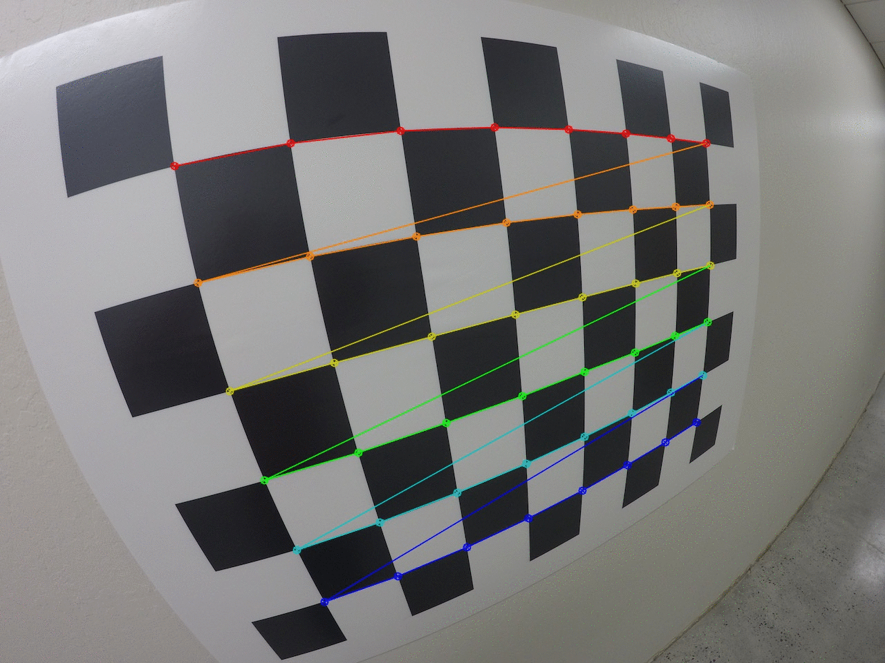  
*Image 1: Chessboard corner detection in calibration input images., (Source images credit: Udacity)* 

Note: The `camera_calib.py` sorts images in to two folders depending on their quality as calibration candidates, The chosen ones will have the detection points overlayed. These can be found on the camera cal folder.

I then used the output `objpoints` and `imgpoints` to compute the camera calibration and distortion coefficients using the `cv2.calibrateCamera()` function.  I applied this distortion correction to the test image using the `cv2.undistort()` function and obtained this result: 

![alt text][calib_undistorted]

### Pipeline (single images)
single images

#### 1. Provide an example of a distortion-corrected image.

[dist_corr_testimg]: ./test_images/test_image_outputs/undistort_out.png "Undistorted"

To demonstrate this step, I will describe how I apply the distortion correction to one of the test images like this one:

![alt text][dist_corr_testimg]

Once I got the camera matrix (mtx_) and distortion coefficients (dist_) I used the opencv `undistort` function. 

`undistorted = cv2.undistort(_testimg, _mtx, dist_, None, calib_mtx)`


#### 2. Describe how (and identify where in your code) you used color transforms, gradients or other methods to create a thresholded binary image.  Provide an example of a binary image result.

After extrinsic calibration, the next tasks were choosing the gradient range and fine-tune the picture for color. For this we need to find the best color space that will help us easily parameterize the detection of line features. The Hue, Lightness and Saturation space seemed to give better choices over conventional RGB as it made possible to select between colors and separated the lightness and saturation from the picture that can usually vary based on the conditions. 

My first task here is to filter out a range of gradients, Here I have the option to split the image into sub-regions corresponding to left and right lanes. However I think even though this may be beneficial in a straight/wide road this may be detrimental in a scenario where we are tackling narrow winding roads. (e.g. Challenge video or a real world scenario). One alternative is to use the symmetry, but in addition to not working in steep curving scenarios doing so may cause instabilities in situations such as exiting the driving position and crossing lanes to reposition the vehicle, The other alternative is to use two ranges which will be affected the least amount by previously mentioned scenarios.

[The code listing](code/gradient_select.py) in `code/gradient_select.py` is an interactive app to select a range of starting gradients. It uses x, and y gradients and inverse tangents to compute the gradient angle.
```python

sobel_x = cv2.Sobel(grayimg, cv2.CV_64F, 1, 0, ksize=sobel_kernel)
sobel_y = cv2.Sobel(grayimg, cv2.CV_64F, 0, 1, ksize=sobel_kernel)

'''
convert image x, y(rows,cols) to Cartesian x, y for ease of visualizing while taking abs 
by swapping axes
'''

abs_sobel_x = np.absolute(sobel_y)
abs_sobel_y = np.absolute(sobel_x)

arct_img = np.arctan2(abs_sobel_y, abs_sobel_x)

```

However it is important to keep in mind the shape of the `arctan` function and it's non-linearity. also because we are using the absolute sobel values the symmetry about `0`(gradient) is embedded into our solution.

The gradient selector code uses the `filter_threshold` function to filter out the selected range.

```python
sobel_bin_filtered = np.zeros_like(self.arct_img)
sobel_bin_filtered[(self.arct_img >= thresh[0]) & (self.arct_img <= thresh[1])] = 5

binary_output = np.copy(sobel_bin_filtered)

```

Note: Note that I've used a very low value (e.g 3) as the threshold for the derivative, that is a choice figure that may change bases on the ISP settings of the capture pipeline, Images with higher sharpness can induce a high degree of noise on a derivative image, pushing down the threshold helps observe dominant features otherwise can get lost in the background, the effect of this approach is further highlighted when we do binary operations with Hue filters later.

Then we choose turn into color spaces, here I have opted to use two hue bands in the HLS color-space, the main reason being road lane colors having more than one color (In the UK/US we tend to have yellow/red on the sides and usually white in the middle and in paces like EU/Germany yellow lines have high precedence over white)

[The code listing](code/hls_filter.py) in `code/hls_filter.py` shows how I've implemented these ideas. The color selection is done by color-space conversion and channel extraction

```python

hls            = cv2.cvtColor(img, cv2.COLOR_BGR2HLS);
self.H_channel = hls[:,:,0];

```

Then I extract the two hue bands and crate a composite image for review and a binary output image to understand how the actual filter would look like.

```python

h1_binary_t = np.zeros_like(self.H_channel);
h2_binary_t = np.zeros_like(self.H_channel);
h1_binary_t[(self.H_channel >= self.hue1_min) & (self.H_channel <= self.hue1_max)] = 1;
h2_binary_t[(self.H_channel >= self.hue2_min) & (self.H_channel <= self.hue2_max)] = 1;
# Composite image
self.composite_stacked = np.dstack((np.zeros_like(self.H_channel), h1_binary_t, h2_binary_t)) * 255;

combined_binary = np.zeros_like(self.H_channel);
# Binary image
combined_binary[(h1_binary_t == 1) | (h2_binary_t == 1)] = 255;

```

The results of the operations are shown below. 

![results][image7]
*Hue composite image | Hue binary image | Derivative image | Combined binary image* 

To get this result I combined the two modules and made one interactive app so I could see the component changes and the resultant binary images. The code can be found [here](code/hls_and_gradient_filter.py) (at `code/hls_gradient_filter.py`)

Below is an example of an image taken from the test images folder, 
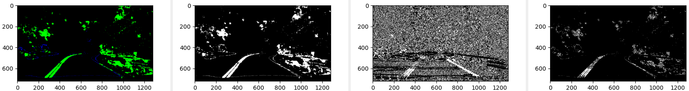
![Gradient and color-space separated image][image3]

As the last exercise of this section I added a Hue filter. 

```python

hls = cv2.cvtColor(img, cv2.COLOR_BGR2HLS);

...
# filter Hue
self.S_channel  = hls[:,:,2];
s_binary_t = np.zeros_like(self.S_channel)
s_binary_t[(self.S_channel >= self.smin) & (self.S_channel <= self.smax)] = self.saturation_threshold

...
# Final output 
combined_hue_sat_grad_binary[(combined_binary == 255) & (filtered_gradient == self.derivative_view_thresh) & (s_binary_t == self.saturation_threshold)] = 255

```
The final result looks much cleaner. Remember this is an image without a perspective transform, From the bird's eye perspective the the x derivative will produce stronger results with it's sharper transition.
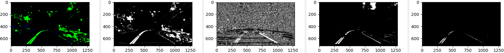
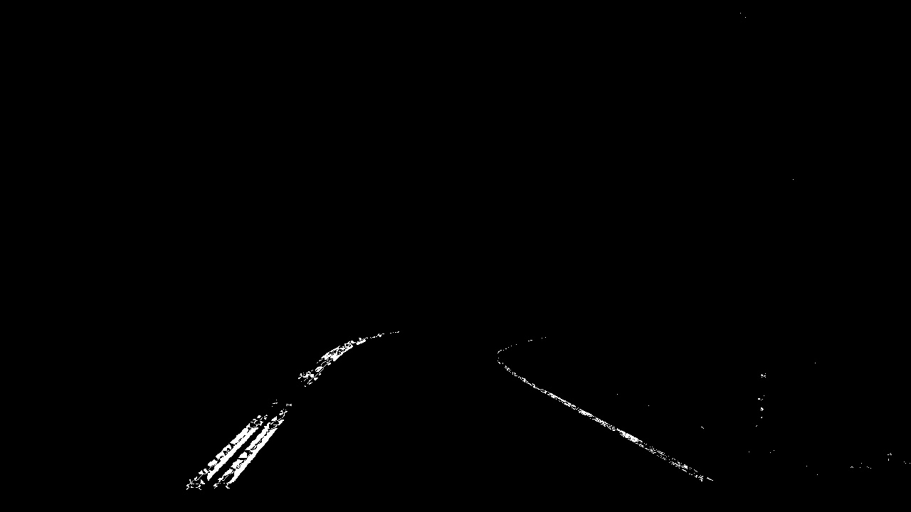


#### 3. Describe how (and identify where in your code) you performed a perspective transform and provide an example of a transformed image.

Step 1: Either find an ideal location like an empty car park or a quiet road to find source and destination points. (Can use publicly known information such as standard widths too) 
*It is important to keep in mind that steeper the angle to the target perspective the more feature distortion we will get* 

Step 2: Measure the geometry (Ideally a suitable are that encapsulates the workspace in full)

Step 3: Create the mapping for source and destination points

| Source        | Destination            | 
|:-------------:|:----------------------:| 
| 229, 253      | 150, 100               | 
| 469, 265      | 150 + 285 , 100        |
| 521, 282      | 150 + 285 , 100 + 176  |
| 13, 297       | 150, 450               |

*Note: The extra offsets are aides to form the shape while maintaining the real world proportions.*

Step 3: Export the images and the calculations to the `getPerspectiveTransform` function. *[Because this is a one off operation I performed all the tasks inside the body of the main execution unit (manually extracting the point vectors)]*

Step 4: Apply the transformation to the undistorted image.

```python

P1 = np.array([229, 253])
P2 = np.array([469, 265])
P3 = np.array([521, 282])
P4 = np.array([13, 297])

# source points vector
src_road = np.float32([
        P1,
        P2,
        P3,
        P4
    ])

# destination points vector
dst_road = np.float32([
    [150, 100],
    [150 + 285 , 100],
    [150 + 285  , 100 + 176],
    [150, 450]
])

# perspective transformation matrix
M_ppt = cv2.getPerspectiveTransform(src_road, dst_road)

```

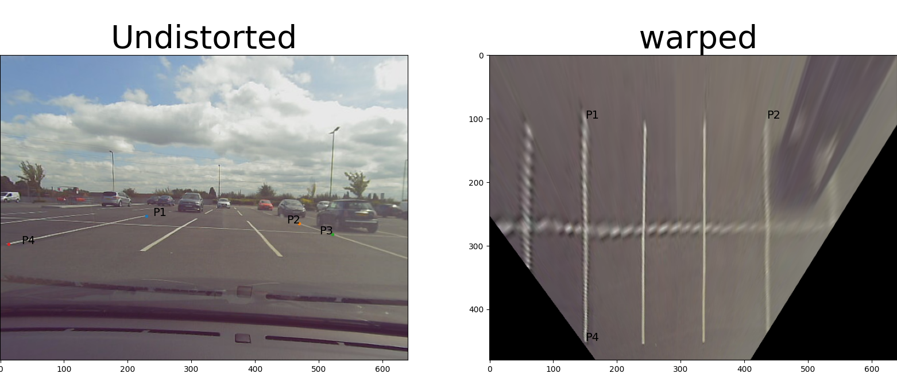
*Image: A supermarket Car park with rectangular guide lines*

using the `M_ppt_road` I was able to successfully apply the transformation to the undistorted image as shown above.

```python
# perspective transformed image
warped_road = cv2.warpPerspective(undistorted_road_img, M_ppt, (640, 480)) 

```
the code for 3. can be found [here](code/perspective_transform.py) (`code/perspective_transform.py`)

#### 4. Describe how (and identify where in your code) you identified lane-line pixels and fit their positions with a polynomial?

*Step 1:* I used the steps above to clean my workspace as much as possible of pixels belonging to other artifacts.

*Step 2:* I segmented the image into parameterized slices, then segmented the image into two halves along the horizontal(x) axis and used the max valued corresponding histogram bins as a hypothesis to place my more focused rectangular ROIs(for left and right lanes) as shown in the code listing below.

```python

...

nwindows = 9
margin   = 50
minpix   = 5

...

'''
creates a slice image and it's histogram
@param img        : source image
@param precentage : how much of the image is sliced (from bottom) 
'''
def sliceimg_and_histogram(img, precentage):
    image_length = np.shape(img)[0]
    slice_start  = np.int((image_length/100.)*precentage)
    x_           = slice_start if (image_length - slice_start)//nwindows > 0 else image_length - nwindows # to stop crashing poly-fit 
                                                                                                # due to insufficient rows w.r.t nwindows
                                                                                                # we alloate the minimum slice hight to be a function of nwindows.
                                                                                                # however it may still throw an error if there are no 'lane-pixels'
                                                                                                # within the slice. 
    sliced      = img[x_:,:]
    norm_sliced = sliced/255
    thist       = np.sum(norm_sliced, axis=0)
    retimg      = np.copy(sliced)

    return retimg, thist

...


sliced, hist   = sliceimg_and_histogram(grayimg, np.int(val))

out_img        = np.dstack((sliced, sliced, sliced))
midpoint       = np.int(hist.shape[0]//2)

leftx_base     = np.argmax(hist[:midpoint])
rightx_base    = np.argmax(hist[midpoint:]) + midpoint 

window_height  = np.int(sliced.shape[0]//nwindows)

leftx_current  = leftx_base
rightx_curernt = rightx_base

...

for window in range(nwindows):


        winy_low  = sliced.shape[0] - (window + 1) * window_height
        winy_high = sliced.shape[0] - window * window_height

        winx_left_low  = leftx_current - margin
        winx_left_high = leftx_current  + margin

        winx_right_low  = rightx_curernt - margin 
        winx_right_high = rightx_curernt + margin 

        cv2.rectangle(out_img, (winx_left_low, winy_low), (winx_left_high, winy_high), (0, 255, 0), 2)
        cv2.rectangle(out_img, (winx_right_low, winy_low), (winx_right_high, winy_high), (0, 255, 0), 2)

...

```


*Step 3:* Then within my new and more narrow rectangular ROI I searched for nonzero (filtered for lane like attributes in earlier sections) pixels and populated/extended my containers that will later feed into numpy's `polyfit` function.

```python
...

'''
    y coordinates are determined by the window slice, to find the x-coordinates 
    we wil get the slice and check how much non-zero pixels fall within the rectangle
'''

subset_ = sliced[(nwindows - window - 1 ) * window_height: (nwindows-window ) * window_height, :]
subset_nonzero = subset_.nonzero()
subset_nzx = subset_nonzero[1]
subset_nzy = subset_nonzero[0]

non_zero_rect_intersects_left  = ((subset_nzx >= winx_left_low)  & (subset_nzx <= winx_left_high)).nonzero()[0]
non_zero_rect_intersects_right = ((subset_nzx >= winx_right_low) & (subset_nzx <= winx_right_high)).nonzero()[0]
...
```

*Step 4:* I repeated the extraction of the rectangular ROI and `Step 4` until I've covered the constrains set by my parameters and ran `polyfit` to find the coefficients I can apply yp my `y`(row/height) values. 

***Note:*** *To prevent my base reference from flying away I used a complimentary filter. (to restrict it's rate of movement)*

```python

if(len(non_zero_rect_intersects_left)) > minpix:
    leftx_current = np.int(leftx_current*(1-alfa) + np.mean(subset_nzx[non_zero_rect_intersects_left]) * alfa)
if(len(non_zero_rect_intersects_right)) > minpix:
    rightx_curernt = np.int(rightx_curernt*(1-alfa) + np.mean(subset_nzx[non_zero_rect_intersects_right]) * alfa)

```
The image below is the output of my [code](code/poly_lane_finding_smooth.py) (`code/poly_lane_finding_smooth.py`)

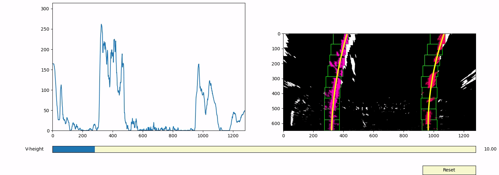
<!-- <p align="center">
  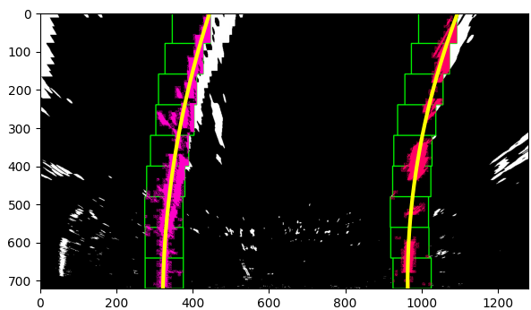
</p> -->
With this setup I was able to examine the effects caused by distortions towards the top end of the picture.


#### 5. Describe how (and identify where in your code) you calculated the radius of curvature of the lane and the position of the vehicle with respect to center.

Radius problem: I used the polynomial () in section 4. and the formula for radius of a polynomial at a given point`y` to obtain the radius.    

 I used this formula for both left and right lanes and then averaged the two values to get a single value for the radius. This included the application of the scaling factors to convert pixel values to the real world dimensions. this would have been a simple calculation if the pixels were symmetrical but we had to apply scaling for x and y directions to account for cases because this symmetry is not present in our processed images in addition to the pixels and pixel maps being non asymmetric and uniform.

I will first show the polynomial fit first and explain the scaling in two ways (one using the Udacity lecture method and another that doesn't require us to do a polynomial fit again)

```python

left_fit_cr    = np.polyfit(LHS_lane_y_coords_m , LHS_lane_x_coords_m , 2)
right_fit_cr   = np.polyfit(RHS_lane_y_coords_m , RHS_lane_x_coords_m , 2)

```
polyfit function finds coefficients to fit a polynomial that looks like 
x = p[0] * y^2 + p[1] * y + p[2]
this polynomial can be plotted in a pixel map with x and (horizontal) y(vertical) axes.

In the method given in the course we have to re run the polyfit with pixel coordinates mapped to meters, I obtained that mapping as shown in the code below. 

```python

LHS_lane_y_coords_m = [i * ym_per_pix for i in LHS_lane_y_coords]
LHS_lane_x_coords_m = [i * xm_per_pix for i in LHS_lane_x_coords] 

RHS_lane_y_coords_m = [i * ym_per_pix for i in RHS_lane_y_coords]
RHS_lane_x_coords_m = [i * xm_per_pix for i in RHS_lane_x_coords]


left_fit_cr  = numpy.polyfit(LHS_lane_y_coords_m , LHS_lane_x_coords_m , 2)
right_fit_cr = numpy.polyfit(RHS_lane_y_coords_m , RHS_lane_x_coords_m , 2)

```

The other method is to find a way to modify the existing polynomial coefficients (obtained from pixel proportions). Same as earlier we rely on the two scaling relations.
```math
x' = x * m_per_px_in_x_dir
y' = y * m_per_px_in_y_dir
```
to convert the modified pixmap to a cartesian map of meters we can use the equations above to look like below. here `x'` and `y'` are the new coordinates in meters `m_ypix` and `m_xpix` are the scaling factors `m_per_px_in_y_dir` and `m_per_px_in_x_dir`.

The original relation:


How pixels and meters are related:


We can substitute from above:


Then re-arrange the coefficients, but from physical meaning if what's happening we can directly multiply the *RHS* with `m_xpix` straight away and create `x'` on *LHS*.  


Now we can separate the new coefficients that we can use to update our coefficient vectors `left_fit_cr` and `right_fit_cr`.


The new polynomial becomes 


now we can modify the coefficients in python 

```python
p'[0] = p[0] * m_per_px_in_x_dir * (1/m_per_px_in_y_dir)**2
p'[1] = p[1] * m_per_px_in_x_dir * (1/m_per_px_in_y_dir
p'[2] = p[2] * m_per_px_in_x_dir
```
and then we can get the resulting coefficient vectors by modifying what we got earlier. I've Implemented both approaches and commented out the first one and the comparison outcomes that demonstrate these methods provide similar results. (*Note:* In practice due to computer base, numerical stability and precision the produced results may not perfectly align.)

##### Radius:

for radius calculation I simply used the radius formula with the results and the y coordinates at the bottom (As I mentioned earlier in a more realistic scenario the y for the effective radius may shift with the system response) 

```python
# source coordinates are pre-scaled 

y_eval_m = y_eval * ym_per_pix;
left_curverad  = np.sqrt((1 + (2*left_fit_cr[0]*y_eval_m  + left_fit_cr[1])**2)**3)/np.fabs(2*left_fit_cr[0])
right_curverad = np.sqrt((1 + (2*right_fit_cr[0]*y_eval_m + right_fit_cr[1])**2)**3)/np.fabs(2*right_fit_cr[0])

avg_radius     = (left_curverad + right_curverad) / 2.

```
##### Vehicle position: 
I assumed that the midpoint of the image coincides with the centre axis of the vehicle and then calculated the offset to the lane centre. To get the lane centre I used the equations of the polynomial and substituted an apt y value.(This way I can tweak the effective radius based on vehicle speed and system response in a more realistic application)


```python

'''
Vehicle position detection:
Here we assume the Image centre is aligned with the vehicle centre. 
Our goal is to find the pixel offset between the midpoint of lanes and the midpoint of the vehicle.

Note: The actual useful centre point is a function of speed and the delay compensation, however we use y_eval for this project
'''
left_x  = left_fit[0]*y_eval**2  + left_fit[1]  * y_eval + left_fit[2]
right_x = right_fit[0]*y_eval**2 + right_fit[1] * y_eval + right_fit[2]

lane_centre = (left_x + right_x) // 2;
vehicle_offset = (midpoint - lane_centre) *1.

msg  = "Vehicle is " + "%.2f" % np.abs(vehicle_offset * xm_per_pix * 1.)  + "m " +  ("left" if (vehicle_offset > 0) else "right") + "of centre"; 
cv2.putText(out_img, msg   , (midpoint -100, 100)  , cv2.FONT_HERSHEY_SIMPLEX, fontsize, (252, 186, 3), 2 , cv2.LINE_AA)
```

the code for 5. can be found [here](code/poly_lane_finding_smooth.py) (`code/poly_lane_finding_smooth.py`)


#### 6. Provide an example image of your result plotted back down onto the road such that the lane area is identified clearly.

Once I calculated the polynomial coefficients I used the following steps to calculate the vertices of a polygon encompassing the lane area and transform that area back to the source image using the inverse of the perspective transform matrix. 

Step 1: Calculate the x coordinates using the polynomial equation. *(In a more realistic application we can reduce the y resolution by limiting the number of considered points)*

```python
# 'sliced' is the image in consideration 
ploty = np.linspace(0, sliced.shape[0] - 1, sliced.shape[0])

left_fitx  = left_fit[0]*ploty**2  + left_fit[1]  * ploty + left_fit[2]
right_fitx = right_fit[0]*ploty**2 + right_fit[1] * ploty + right_fit[2
```

Step 2: Extract the x and y vectors, flip one side to maintain constant span and convert to homogeneous coordinates by appending a 1 to the point vector. 

```python
rightx_flipped = np.flipud(right_fitx)
xs = np.concatenate((left_fitx, rightx_flipped));
y_flipped = np.flipud(ploty_augmented)
ys = np.concatenate((ploty_augmented , y_flipped));
poly_points = np.concatenate((xs.reshape(xs.shape[0], 1), ys.reshape(ys.shape[0], 1)), axis=1, out=None) # can't set datatype in this version (< 1.20.0)
hom_augment_ones = np.ones((poly_points.shape[0], 1), dtype=float)
hom_poly_points = np.concatenate((poly_points, hom_augment_ones), axis=1).T # we have to transpose because we right multiply with the 3*3 matrix
```

Step 3: Perform the Matrix operation by multiplying the polygon vector with the inverse of the perspective transform matrix, normalizing by using the homogeneous form and trimming the vector to create 2D points. Finally we update the polygon figure.

```python
img_lane_poly = m_ppt_inv.dot(hom_poly_points)
img_lane_poly_hom = (img_lane_poly/img_lane_poly[-1]).T # normalise then, back to a vector per row form 
img_lane_poly_xy = img_lane_poly_hom[:,0:2] # trim to make 2D points

lane_area_polygon.set_xy(img_lane_poly_xy)
```
The image below is the output of my [code](code/poly_lane_finding_backproj.py) (`code/poly_lane_finding_backproj.py`)


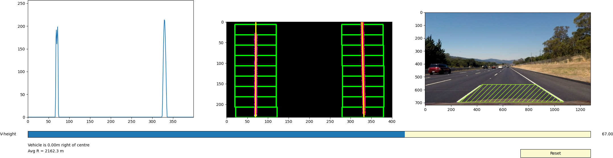


*Even though this give us these theoretical values the curvature is instant and is constantly changing through a curve*

Below is the same process used in a frame from the harder challenge video.
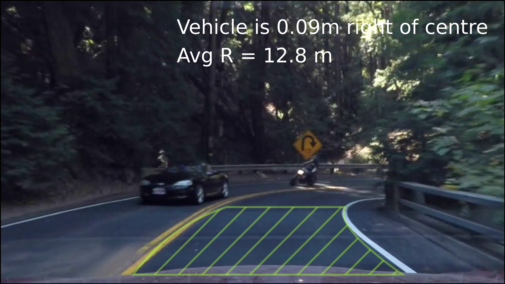

The concern here is the offset between the vehicle axis and the lane axis, That deviation imposes a larger effect in the position calculation and relatively smaller but potentially significant effect on the location of the 
instantaneous centre of curvature. 


---

### Pipeline (video)

#### 1. Provide a link to your final video output.  Your pipeline should perform reasonably well on the entire project video (wobbly lines are ok but no catastrophic failures that would cause the car to drive off the road!).

Here's a [link to my video result](./project_video.mp4)

---

### Discussion

#### 1. Briefly discuss any problems / issues you faced in your implementation of this project.  Where will your pipeline likely fail?  What could you do to make it more robust?

Here I'll talk about the approach I took, what techniques I used, what worked and why, where the pipeline might fail and how I might improve it if I were going to pursue this project further.  

#### Summary:

Going into the project my plan was to build a pipeline that looks like something below.

1. Stick to the course material presented so far.
2. Must be one generic pipeline app.
3. Tackle all Three videos with zero customization to suit the current video.
4. Be Efficient and adaptive (i.e. don't throw all the all the computation power at all frames and excessive filtering that may look good but will increase processing time).
5. It should be aware of it's state and disable the output if not working well for some time.
6. If possible carry over internal state to the next video.

**Result:**

*Link to source:* **[`code/pipeline.py`](code/video_pipeline.py)**

| Source video | Result video (local file link) | Result video (web URL) | 
|:--:|:--:|:--:|
| [video 1 source](project_videos/project_video_1.mp4) | [video 1 result](project_videos/processed/latest/OUT_project_video_1.mp4)  | [youtube link](https://youtu.be/9Ahh9WxfdPc) | 
| [video 2 source](project_videos/project_video_2.mp4) | [video 2 result](project_videos/processed/latest/OUT_project_video_2.mp4)  | [youtube link](https://youtu.be/TO0gw3Gpnno) |
| [Video 3 source](project_videos/project_video_3.mp4) | [video 3 result](project_videos/processed/latest/OUT_project_video_2.mp4)  | [youtube link](https://youtu.be/boG-rywRS8s) |


*Note: local video will update every time you run the [pipeline script](code/video_pipeline.py), for the file links to work run it at least once within the source directory* 


1. Pipeline works near perfectly on [video 1](project_videos/project_video_1.mp4).
2. Realistically only tracks the left lane of [video 2](project_videos/project_video_2.mp4) (but approximates the other lane to a certain degree).
3. Does not work in [video 3](project_videos/project_video_1.mp4) (but I've included the result).
4. Switches Reasonably well between the *dynamic window approach* and the *proximity fit approach* and turns itself off when in too much trouble.


**Conclusion**

1. I have set off to be practical and reasonable in a non-practical scenario (because this will never be good enough to run in a real life scenario) 
2. Temporal filtering is super helpful (specially when color filtering fails in highly saturated patches).
3. I should've done a better job at color and gradient filtering or the choice to have non-dynamic values was wrong.
4. When consecutive decent DWAs happen I should've done more meaningful carry over (Seem to be more effective in narrow and wining scenarios)
5. Should've used a bigger binary source mask (at least width wise because in harder challenge it clips what's already occluded).
6. In real-time control it is very important to be in the present as much as tempting it is to be in the past (the more stable region of the filter)
7. I have used lane coefficients to get the polygon, instead I could've tried the converse (use the evolving constrained pixel polygon to infer polynomial coefficients) even it sounds more monte carlo esque


**The Process**

The program loosely replicates a state machine that is run on image frames. It has two main operating modes. (1. DWA mode 2. PROXIMITY fit mode) once a frame is taken from the source the `prepare_image` function 
does the visual processing and returns a binary image, a histogram and a distortion corrected image. 

*DWA Mode:*
This is a slightly modified version of the Dynamic window mode, this is the more brute force approach that is used to scan the input image by slicing and searching upwards (outwards from the vehicle)
based on the window parameters. 

*PROXI-FIT:*
The proximity fit works bases on a prior hypothesis. This is the same approach discussed in the course material. basically instead of discrete windows a narrow search area is predicted using the prior result. 

Then based on the situation the handling function chooses either processing mode and they return metadata, lane lines and polygons to be drawn on the final composite image. The resulting video files are time-stamped and stored in the `project_videos/processed` directory. In the `project_videos/processed/latest` directory symbolic links to the latest files are created and updated. 


**Debug information**

Proxi-fit mode 

The picture below shows The operation in proxi-fit mode.

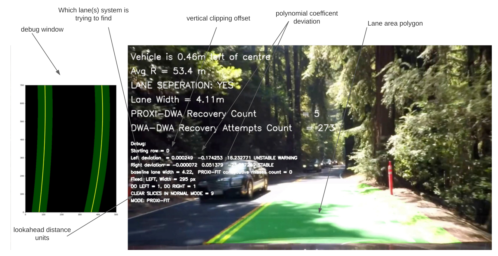

The picture below shows the operation in DWA mode.

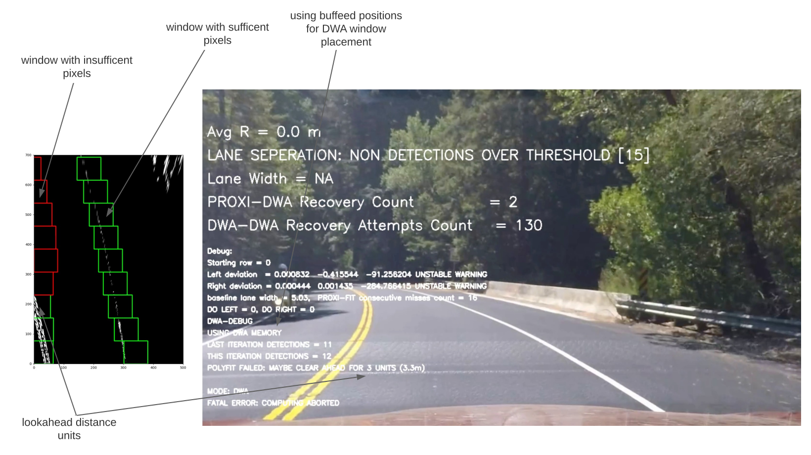

Final word:

By doing this project I realised that the real world is clearly unforgiving and where the current paradigm may fail it is worth starting to think in new ways and build new paradigms rather than twisting what is in hand to the point where gains in complexity isn't necessarily making proportionate gains in productivity. I think it worked where it was expected to work and failed where it was expected to fail..

